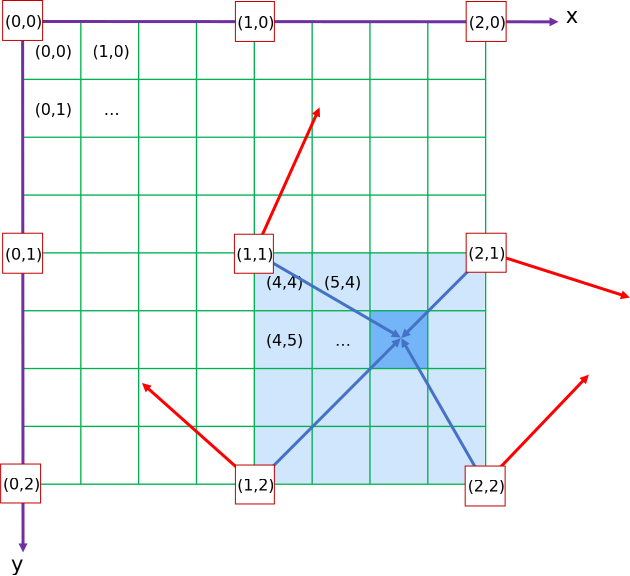
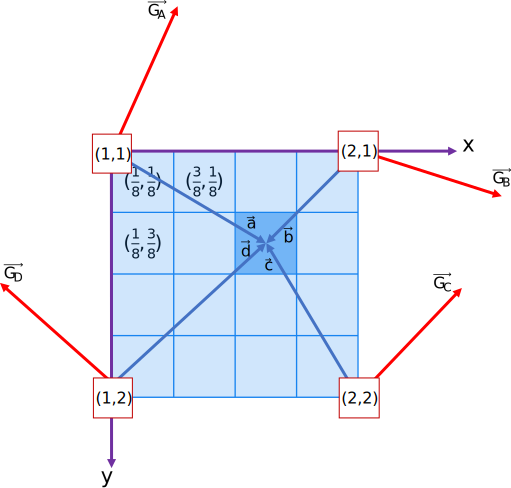

# View Generator <!-- omit in toc -->

## Pitch <!-- omit in toc -->

The goal of this project is to randomly generate landscape images.

## Table of Contents <!-- omit in toc -->

- [Project environment](#project-environment)
- [Generate Bitmap Images](#generate-bitmap-images)
  - [Little-endian format](#little-endian-format)
  - [Bitmap file header](#bitmap-file-header)
  - [Bitmap information header](#bitmap-information-header)
  - [Pixel structure](#pixel-structure)
- [Multi Dimensional Grid Perlin Noise](#multi-dimensional-grid-perlin-noise)
  - [Perlin Noise](#perlin-noise)
  - [Grids definitions](#grids-definitions)
  - [Dot Product](#dot-product)
  - [Interpolation in n dimensions](#interpolation-in-n-dimensions)
- [Authors](#authors)

## Project environment

| Purpose     | Software     |
| :---------- | :----------- |
| Versioning  | Git          |
| Indentation | Clang-format |
| Developing  | VSCode       |
| Language    | C++          |
| Compiling   | MinGW        |

## Generate Bitmap Images

Bitmap images are used as output for the generator. Their structure consist of two fixed-size headers followed by a variable-sized pixels structure.
All of the integer values are stored in little-endian format.

- [More about BMP File Format](https://en.wikipedia.org/wiki/BMP_file_format)

### Little-endian format

The least significant byte value is at the lowest address. The other bytes follow in increasing order of significance.

| Decimal value | Hexa little-endian | Hexa big-endian |
| :-----------: | :----------------: | :-------------: |
|      24       |       18 00        |      00 18      |

### Bitmap file header

The first header contains general information about the file.

| Offset | Size (Bytes) | Purpose                                | Value (decimal) |
| :----: | :----------: | :------------------------------------- | :-------------: |
|   00   |      2       | Header field used to identify the file |      'BM'       |
|   02   |      4       | Size of the BMP file in bytes          |        *        |
|   06   |      4       | Reserved (creator information)         |        0        |
|   10   |      4       | Starting byte of the pixel array       |       54        |

### Bitmap information header

The second header contains information about the image.

| Offset | Size (Bytes) | Purpose                                        | Value (decimal) |
| :----: | :----------: | :--------------------------------------------- | :-------------: |
|   14   |      4       | Size of this header in bytes                   |       40        |
|   18   |      4       | Bitmap width in pixels                         |        *        |
|   22   |      4       | Bitmap height in pixels                        |        *        |
|   26   |      2       | Number of color planes                         |        1        |
|   28   |      2       | Number of bits per pixel (rgb 3x8)             |       24        |
|   30   |      4       | Compression method being used                  |        0        |
|   34   |      4       | Image size                                     |        0        |
|   38   |      4       | Image horizontal resolution in pixel per meter |        0        |
|   42   |      4       | Image vertical resolution in pixel per meter   |        0        |
|   46   |      4       | Number of colors                               |        0        |
|   50   |      4       | Number of important colors                     |        0        |

### Pixel structure

The data structure contains all the image pixel. The pixels are stored from the bottom left to the top right.
A pixel is composed of 1 Byte for each color. Here the RGB format is used, pixel are 3 Bytes long.
Padding is an array of Bytes set to 0. It is added at the end of each row so that the total width of the image is a multiple of 4 Bytes.

| Offset | Size (Bytes) | Purpose      | Value (decimal) |
| :----: | :----------: | :----------- | :-------------: |
|   54   |      3       | Pixel\[0,2\] |        *        |
|   57   |      3       | Pixel\[1,2\] |        *        |
|   60   |      3       | Pixel\[2,2\] |        *        |
|   63   |      3       | Padding      |        0        |
|   66   |      3       | Pixel\[0,1\] |        *        |
|   69   |      3       | Pixel\[1,1\] |        *        |
|   72   |      3       | Pixel\[2,1\] |        *        |
|   75   |      3       | Padding      |        0        |
|   78   |      3       | Pixel\[0,0\] |        *        |
|   81   |      3       | Pixel\[1,0\] |        *        |
|   84   |      3       | Pixel\[2,0\] |        *        |
|   87   |      3       | Padding      |        0        |

## Multi Dimensional Grid Perlin Noise

### Perlin Noise

A perlin noise is a gradient noise developed by Ken Perlin in 1983. A list of random numbers could seem chaotic and produce a non-continuous aspect. This algorithm uses random gradients to create a continuous evolution through the different points of the list.

### Grids definitions

This project uses two grids composed of hypercubes as base element, but any type of grid could be used. Hypercubes are squares in 2D and cubes in 3D. A grid is represented here as a multi-dimensional array.

- The first grid is a n-dimensional array, n being the chosen dimension of the noise. Each element of the array is a real number between 0 and 1. This number is the value of the noise at the local corresponding point. In two dimensions it could be seen as a pixel.
- The second grid is a n-dimensional array where every element is a n-dimensional vector. Therefore, this grid can also be seen as a 2n-dimensional array of real numbers. It represents the gradient grid. every cell containing a random gradient vector, normalized and with the same dimension as the noise. The gradient grid is smaller than the noise one, with a factor called period. If one dimension of the noise grid were n, the corresponding dimension of the gradient grid would be n/p +1, where p is the period.

Every noise cell has 2 to the n-th power surrounding gradient cells.

>Figure 1: 2D Noise grid in green and corresponding gradient grid in red.
>>Every noise cell (green) has 4 corresponding gradient cells (red).

### Dot Product

For each point of the noise grid, the distance vector between the surrounding gradient cells and the point has to be calculated. Then the dot product between each gradient vector of each cell and its corresponding distance vector is computed.
The distance vector is represented along a dimension by the number of noise cells between the gradient cell and the current point divided by the period. Its coordinates are the result of the point coordinates subtracted by the gradient cell coordinates. An easy way to get every gradient cell coordinates in the right order for n dimensions is through the gray binary code. Indeed, going from a gradient cell to another is moving along only 1 dimension.

>Figure 2: Local grid of noise cells between their surrounding gradient cells in 2D.

### Interpolation in n dimensions

Those 2 to the n-th power dot products have to be interpolated. That means they are summed up with a certain weight depending on how far they are from the current point. The trick to make this algorithm is that a n-dimensional interpolation is a 1D interpolation between the two n-1-dimensional interpolations of each half of the dot products.

>Figure 3: 2D bilinear interpolation.
>>It is a barycentric system.

An easy way to compute a n-dimensional interpolation is through a recursive function of lesser dimensional interpolations. in order to do that the dot values have to be in the correct order, because every time the interpolation is split into 2 smaller interpolations the first one has the dot product value at the right order but the second one is inverted. In Figure 2 it can be seen that values C and D are not in the right order, C has a weight of 1-X and not X. So, to apply this algorithm the values have to be reorganized. Here again the Gray binary code can be used. The k-th value is switched the k'-th vertex of the gradient grid where k' is the corresponding Gray value of k.

>Figure 4: 3D Gradient grid with a current noise point being calculated.
>>Some results are switched with the Gray binary code to be in the correct order for interpolations.

For Perlin noise it is not a linear interpolation. A smoothstep function is used so that the weight is not proportional to the distance between the gradient cell and the current point. This is a trick to avoid artefact of the noise.

>Figure 5: Plot of a smoothstep function.
>>The effect is making the weight of a dot product value less important if the point is far from it.

With all those steps a perlin noise grid is created. A harmonic random variation through multiple dimensions. The finale noise value can be normalized between 0 and 1. A way to get more vibrant values is to use a sigmoid function, increasing the noise contrast.

>Figure 6: 3D Perlin noise represented as a 2D slice moving along the 3rd dimension through time.

## Authors

Florian Mercier
