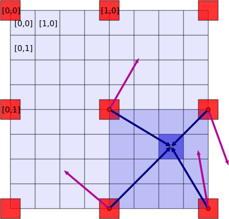
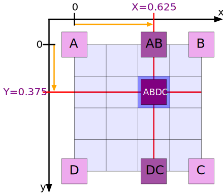

# View Generator <!-- omit in toc -->

## Pitch <!-- omit in toc -->

The goal of this project is to randomly generate landscape images.

## Table of Contents <!-- omit in toc -->

- [Project environment](#project-environment)
- [Generate Bitmap Images](#generate-bitmap-images)
  - [Little-endian format](#little-endian-format)
  - [Bitmap file header](#bitmap-file-header)
  - [Bitmap information header](#bitmap-information-header)
  - [Pixel structure](#pixel-structure)
- [Multi-Dimensional Perlin Noise Grid](#multi-dimensional-perlin-noise-grid)
  - [Perlin Noise](#perlin-noise)
  - [General algorithm](#general-algorithm)
  - [Grids definition](#grids-definition)
  - [Distance vectors definition](#distance-vectors-definition)
  - [Dot Product](#dot-product)
  - [Interpolation in n dimensions](#interpolation-in-n-dimensions)
  - [Non-linearity](#non-linearity)
  - [Result](#result)
- [Multi-Dimensional Worley Noise](#multi-dimensional-worley-noise)
  - [Worley Noise](#worley-noise)
  - [General algorithm](#general-algorithm-1)
  - [Random points generation](#random-points-generation)
  - [Distance Calculation](#distance-calculation)
  - [Result](#result-1)
- [Rigged Noise](#rigged-noise)
  - [Rigged Noise algorithm](#rigged-noise-algorithm)
  - [Result](#result-2)
- [Authors](#authors)

## Project environment

| Purpose     | Software     |
| :---------- | :----------- |
| Versioning  | Git          |
| Indentation | Clang-format |
| Developing  | VSCode       |
| Language    | C++          |
| Compiling   | MinGW        |
| Figures     | SVG          |

## Generate Bitmap Images

Bitmap images are used as output for the generator. Their structure consists of two fixed-size headers followed by a variable-sized structure of pixels.
All of the integer values are stored in little-endian format.

- [More about BMP File Format](https://en.wikipedia.org/wiki/BMP_file_format)

### Little-endian format

The least significant byte value is at the lowest address. The other bytes follow in increasing order of significance.

| Decimal value | Hexa little-endian | Hexa big-endian |
| :-----------: | :----------------: | :-------------: |
|      24       |       18 00        |      00 18      |

### Bitmap file header

The first header contains general information about the file.

| Offset | Size (Bytes) | Purpose                                | Value (decimal) |
| :----: | :----------: | :------------------------------------- | :-------------: |
|   00   |      2       | Header field used to identify the file |      'BM'       |
|   02   |      4       | Size of the BMP file in bytes          |        *        |
|   06   |      4       | Reserved (creator information)         |        0        |
|   10   |      4       | Starting byte of the pixel array       |       54        |

### Bitmap information header

The second header contains information about the image.

| Offset | Size (Bytes) | Purpose                                        | Value (decimal) |
| :----: | :----------: | :--------------------------------------------- | :-------------: |
|   14   |      4       | Size of this header in bytes                   |       40        |
|   18   |      4       | Bitmap width in pixels                         |        *        |
|   22   |      4       | Bitmap height in pixels                        |        *        |
|   26   |      2       | Number of color planes                         |        1        |
|   28   |      2       | Number of bits per pixel (rgb 3x8)             |       24        |
|   30   |      4       | Compression method being used                  |        0        |
|   34   |      4       | Image size                                     |        0        |
|   38   |      4       | Image horizontal resolution in pixel per meter |        0        |
|   42   |      4       | Image vertical resolution in pixel per meter   |        0        |
|   46   |      4       | Number of colors                               |        0        |
|   50   |      4       | Number of important colors                     |        0        |

### Pixel structure

The data structure contains all the image pixels. They are stored from the bottom left to the top right.
A pixel is composed of 1 Byte for each color. Here the RGB format is used, pixels are 3 Bytes long.
The padding is an array of Bytes set to 0. It is added at the end of each row so that the total width of the image is a multiple of 4 Bytes.

| Offset | Size (Bytes) | Purpose      | Value (decimal) |
| :----: | :----------: | :----------- | :-------------: |
|   54   |      3       | Pixel\[0,2\] |        *        |
|   57   |      3       | Pixel\[1,2\] |        *        |
|   60   |      3       | Pixel\[2,2\] |        *        |
|   63   |      3       | Padding      |        0        |
|   66   |      3       | Pixel\[0,1\] |        *        |
|   69   |      3       | Pixel\[1,1\] |        *        |
|   72   |      3       | Pixel\[2,1\] |        *        |
|   75   |      3       | Padding      |        0        |
|   78   |      3       | Pixel\[0,0\] |        *        |
|   81   |      3       | Pixel\[1,0\] |        *        |
|   84   |      3       | Pixel\[2,0\] |        *        |
|   87   |      3       | Padding      |        0        |

## Multi-Dimensional Perlin Noise Grid

### Perlin Noise

A Perlin Noise is a gradient noise developed by Ken Perlin in 1983. A list of random numbers could seem chaotic and produce a discontinuous aspect. This algorithm uses randomly generated gradients to create a continuous yet random evolution. The main goal of this technic is to create harmonic randomness closer to what nature looks like.

- [More about Perlin Noise](https://en.wikipedia.org/wiki/Perlin_noise)


>Figure 1: 2D Perlin Noise.

### General algorithm

Perlin noise generation has the following steps:

- Create a n-dimensional grid which will contain the noise values.
- Generate a n-dimensional grid of random n-dimensional vectors call gradients.
- Define distance vectors between noise cells of the first grid and gradient cells of the second grid.
- For each noise cell :
  - Find the 2 to the n-th power closest gradient cells.
  - Compute dot products between those gradient vectors and the corresponding distance vector.
  - Calculate non-linear interpolations of all those dot products. The results represent the noise value.

### Grids definition

Two grids are needed, one for noise values and one for gradient vectors. A grid is represented here as a multi-dimensional array.

Let be n, a strictly positive natural number, the chosen dimension of the noise.

- The first grid is a n-dimensional array. Each element of the array is a real number between 0 and 1. This number is the value of the noise at the local corresponding point. It could be seen as a pixel.
- The second grid is a n-dimensional array where every element is a n-dimensional vector. Therefore, this grid can also be seen as a 2n-dimensional array of real numbers. It represents the gradient grid. Every cell contains a random gradient vector, normalized and of the same dimension as the noise. If it is considered as an array of vectors, the gradient grid is smaller than the noise grid by a factor called the period. If one dimension of the noise grid were h, the corresponding dimension of the gradient grid would be h/p +1, where p is the period.

A distance between a noise cell and a gradient cell need to be defined. Therefore the two grids have to be in the same representation.

Let the noise grid be the structure, it is represented as a grid with its cells adjacent to one another. The gradient grid is split, its cells are not adjacent but periodically distributed over the noise grid. This period is p, defined before. Therefore the final representation is a noise grid on which every p noise cells there is a gradient cell.

To a given noise cell, its local grid is represented by the grid delimited by its 2 to the n-th power closest gradient cells.


>Figure 2: 2D Noise grid and Gradient grid.\
>The current point is in grey in its current cell in dark blue. The gradient cells are in red. The blue vectors are the distance vectors between the point and the surrounding gradient cells. The purples vectors are the gradient vectors of each gradient cell. The blue square is the local grid which is inside a lighter blue square which is a part of the noise grid.

### Distance vectors definition

To compute the distance vectors each local grid has to be graduated.
Let c be the number of the current noise cell in its local grid and p the period of the gradient grid.
Coordinates are represented along a dimension by (c+(1/2))/p.


>Figure 3: 2D Local Grid coordinates of each point.\
>The coordinates do not start from 0 and do not reach 1 to give only non zero distance values to the 4 corner noise cells.

The distance vectors coordinates are the result of the point local coordinates subtracted by the gradient cell local coordinates. An easy way to get every gradient cell coordinates in the right order for n dimensions is through the gray binary code. Indeed, going from a gradient cell to another is moving along only 1 dimension.


>Figure 4: 2D Local Grid calculation of distance vectors.

```
d1 = [0.625,0.375] - [0,0] = [0.625,0.375]
d2 = [0.625,0.375] - [1,0] = [-0.375,0.375]
d3 = [0.625,0.375] - [1,1] = [-0.375,-0.625]
d4 = [0.625,0.375] - [0,1] = [0.625,-0.625]
Here it can be seen that the coordinates of the gradient cells are [00], [10], [11], [01] and the Gray Binary Code is
00, 01, 11, 10. Therefore an inverted Gray Binary Code, with the least important values first, can be used to automate
this calculation algorithm.
```

### Dot Product

For each point of the noise grid there are two kinds of vectors:

- The distance vectors, calculated between the current point and all the surrounding gradient cells.
- The gradient vectors of each cell of the gradient grid.

The dot products of distance vectors and their corresponding gradient vectors have to be calculated. The results can be stored in a temporary array, they will be interpolated to give the noise point its final value.


>Figure 5: A local grid and the results of the dot products.\
>This is a fragment of the noise grid starting at coordinates [X,Y]. The local grid is in blue. The dot products have been calculated and stored as A, B, C and D.

### Interpolation in n dimensions

Those 2 to the n-th power dot products have to be interpolated. That means they are summed up with a certain weight depending on how far they are from the current point. The trick to make this algorithm is through a recursive function. Indeed, a n-dimensional interpolation is a 1D interpolation between the two n-1-dimensional interpolations of each half of the dot products. The dot values have to be in the correct order because every time the interpolation is split into 2 smaller interpolations the first one has its dot product values in the right order but the second one has them inverted.


>Figure 6: 2D bilinear interpolation.

```
Note that the interpolation wanted is DC and not CD, so to keep turning in a trigonometric way and still get
the right interpolation, using the same algorithm, values C and D have to be switched. The Gray binary code
can be used. The k-th value is switched the k'-th one, where k' is the corresponding Gray value of k.
x = Interpolation_2D(A, B, D, C)
  = Interpolation_1D(Interpolation_1D(A, B), Interpolation_1D(D, C))
```


>Figure 7: 3D Gradient grid with a current noise point being calculated.

```
Here again values highlighted in yellow have to be switched.
x = Interpolation_3D(A, B, D, C, E, F, H, G)
  = Interpolation_1D(Interpolation_2D(A, B, D, C), Interpolation_2D(E, F, H, G))
  = Interpolation_1D(Interpolation_1D(Interpolation_1D(A, B), Interpolation_1D(D, C)), Interpolation_1D(Interpolation_1D(E, F), Interpolation_1D(H, G)))
```

### Non-linearity

To get rid of all artifacts caused by linear interpolation Perlin Noise used a Smoothstep function. Weight computation uses a distorted distance between the gradient cell and the current point.


>Figure 8: Plot of a Smoothstep function.\
>The effect is making the weight of a dot product value less important if the point is far from it.

The non-linear interpolation can be seen as a basic interpolation where coordinates have been moved before the calculation.


>Figure 9: Deformed Grid during a non-linear interpolation.\
>The gray points are the points before the Smoothstep function and the blue point are the new points after. A basic interpolation is made with the coordinates of those new points

Here is a visualization of the impact of the non-linearity in interpolation, artifacts are removed. These artifacts are created at the borders between local grids, where the surrounding gradients points are suddenly changing.


>Figure 10: Left : Linear Interpolation, Right Non-Linear (smoothstep) Interpolation

### Result

With all those steps a Perlin Noise grid is created. A harmonic random variation through multiple dimensions. The finale noise value can be normalized between 0 and 1. A way to get more vibrant values is to use a sigmoid function on every output values, increasing the noise contrast.


>Figure 11: 3D Perlin Noise represented as a 2D slice moving along the 3rd dimension through time.

## Multi-Dimensional Worley Noise

### Worley Noise

The Worley noise was created by Steven Worley in 1996. It generates a cellular aspect to imitate nature.

- [More about Worley Noise](https://en.wikipedia.org/wiki/Worley_noise)


>Figure 12: 2D Worley noise.\
>The cellular aspect is due to the "borders" between cells, created by an iso distance between two points.

### General algorithm

Worley noise generation has the following steps:

- Create a n-dimensional grid which will contain the noise values.
- Generate a list of random points in this grid.
- For each cell of the grid, calculate the closest distance to the random points, it will represent the noise value.

### Random points generation

Let take a n-dimensional grid represented as a n-dimensional array of integers. To generate a random point in this grid it is needed to generate random integers representing the point's coordinates.\
Here there are two possibilities:

- Taking a random integer between 0 and the total number of cells and calculate the n different coordinates.
- Taking n random integers from 0 to the size of the grid for all its dimensions. Those n numbers are the n coordinates.


>Figure 13: 2D noise grid and several randomly generated points.

### Distance Calculation

For every cell let's compute the closest distance to the random points. The distance between two points is the square root of the sum of every difference of their coordinates to the square. It is faster to compare squared distances to avoid the square root operations.


>Figure 14: Distances between a given noise cell and all the random points.
>The closest distance is represented in red. It will be the value of the noise cell.

### Result

This algorithm creates a cellular noise. The value of the noise increases as it gets far from a random point then decreases as it comes closer to another one. The iso distance from a point can be seen as circles of the same value around the points.


>Figure 15: 3D Worley Noise represented as a 2D slice moving along the 3rd dimension through time.

## Rigged Noise


>Figure 16: 2D Rigged Perlin Noise

### Rigged Noise algorithm

A rigged noise is a modified noise. It takes any kind of noise and do a symmetry on it from a chosen median value. For example, to a Perlin Noise going from value -1 to 1, its absolute value is a rigged noise with a median value of 0. This technic creates a more rigged kind of noise, with more sharp values around the median.


>Figure 17: A rigged curve in orange from the original blue curve.\
>An axial symmetry is applied around the chosen value.

### Result


>Figure 18: 3D Rigged Perlin Noise represented as a 2D slice moving along the 3rd dimension through time.

It is possible to choose a threshold value in the noise values range. Above this value the noise will be changed to its minimum and under to its maximum. It will create a floored effect, where there are only 2 colors creating shapes and paths.


>Figure 19: 3D Rigged then floored Perlin Noise represented as a 2D slice moving along the 3rd dimension through time.

## Authors

Florian Mercier
